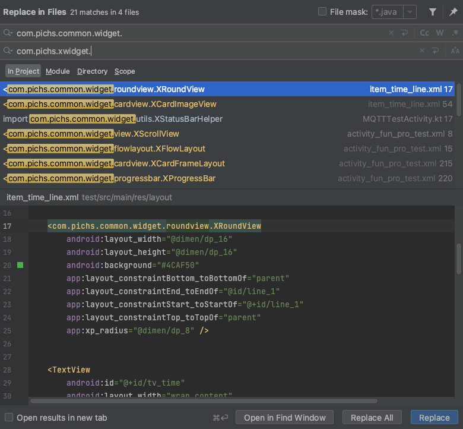
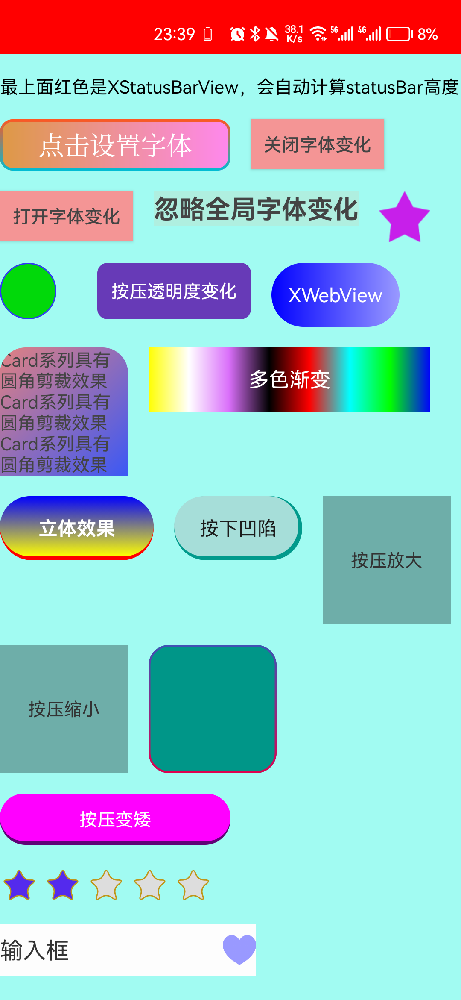

# xwidget

最喜欢的自定义控件，开发更加快乐。

### 引入控件

新版仓库移至mavenCenter

#### 4.x 最新版本:[](https://img.shields.io/maven-central/v/com.gitee.pichs/xwidget)

      implementation 'com.gitee.pichs:xwidget:4.0.0'

### 4.x破坏性升级，仓库移至mavenCenter， 控件包名改为 com.pichs.xwidget.xxxx

#### 3.x 最新版本: [](https://jitpack.io/#com.gitee.pichs/xwidget)

      implementation 'com.gitee.pichs:xwidget:3.2.5'


### 3.x请移步gitee地址 [https://gitee.com/pichs/xwidget](https://gitee.com/pichs/xwidget)

## 3.x升级到 4.x指南
- 全局搜索包名并替换 "com.pichs.common.widget." ->  "com.pichs.xwidget." 即可完成替换，非常的简单！
- 示例：
- 

## 最好用基础组件库，超级轻量级。

- 特色杜绝属性冲突，属性完美复用，属性前缀 ‘xp_’ ,简短快速。

- 圆角，外阴影，圆头跟随高度宽度，渐变色背景->双色渐变：top->bottom，left->right,TL->BR, BL->TR

- 按压效果，仍然支持渐变，圆角等。 支持按压透明变化，disabled透明变化。

- 致力于快速开发基础控件，省去大量写xml文件的时间。效果实时可预览。

### 持续维护，已更新四年了。持续增强更有用的功能，简单而强大。

- 如果用起来不爽，速来提issue

#### 使用示例去 demo中的xml中探索吧。

- 注意：凡是继承自xwidget的基础类的textview都可以实现字体变更

1. 在Application中初始化

   ```
     // 初始化，自动缓存。
     public class App extends Application {
         @Override
         public void onCreate() {
             super.onCreate();
             XTypefaceHelper.init(this, true);
         }
     }
   
     XCardButton btn = findViewById(R.id.btn1);
     btn.setOnClickListener(v -> {
         XTypefaceHelper.setGlobalTypefaceFromAssets(getApplicationContext(), "leihong.ttf");
         XTypefaceHelper.setGlobalTypefaceStyle(getApplicationContext(), XTypefaceHelper.NONE);
     });
     XButton normalBtn = findViewById(R.id.normalBtn);
     normalBtn.setOnClickListener(v -> XTypefaceHelper.resetTypeface(MainActivity.this));
     XButton closeFont = findViewById(R.id.closeFont);
     XButton openFont = findViewById(R.id.openFont);
   
     closeFont.setOnClickListener(v -> XTypefaceHelper.closeTypeface(this));
     openFont.setOnClickListener(v -> XTypefaceHelper.openTypeface(this));
   
   ```

#### 看效果



## 下载体验

[下载体验](https://github.com/pichsy/xwidget/tree/github-xwidget/app/release/xwidget.apk)

## 升级日志

### 4.0.0版本 破坏升级，3.0版本的请移步 gitee 地址 [https://gitee.com/pichs/xwidget](https://gitee.com/pichs/xwidget)

- gitee地址仓库发布在jitpack上
- 新的仓库转移到mavenCenter上

### 3.2.5版本 推荐升级（兼容升级）

- 颜色默认值不再判断为0，改为0x0000000f(15)-该值比较罕见，不会影响到正常的颜色值。
- 增加新的控件 PressedScaleLayout，按压缩放子控件，可以设置缩放比例，缩放动画时间。

            <com.pichs.xwidget.layout.PressScaleLayout
                android:layout_width="300dp"
                android:layout_height="100dp"
                android:background="#A7A7CF"
                android:clickable="true"
                android:padding="16dp"
                app:xp_pressedScale="0.5"
                app:xp_pressedScaleAnimDuration="90">
          
                <com.pichs.xwidget.cardview.XCardTextView
                    android:layout_width="50dp"
                    android:layout_height="50dp"
                    android:gravity="center"
                    android:text="我是子控件"
                    android:textColor="#fff"
                    android:textSize="10dp"
                    app:xp_backgroundGradientColors="#9f1,#42f"
                    app:xp_radius="8dp" />
          
            </com.pichs.xwidget.layout.PressScaleLayout>


- 修复InputLayout close图标显示不正常的问题
- 基础控件都增加了按压事件回调 (XView...等).setOnPressedStateListener(isPressed ->{})

### 3.2.4版

- 修复InputLayout控件 close图标显示不正常的bug。

### 3.2.3版本

- 增加XRatingBar控件，支持自定义星星数量，星星大小，星星间距，星星背景，星星前景，星星数量，星星是否可以点击，星星是否可以半颗星

### 3.2.2版本

- 修复statusbarheight方法，在鸿蒙os3.0上获取数值不对的问题。

### 3.2.1版本

- 增强TimerManager的稳定性。

### 3.2.0 版本

- 兼容新增 xp_cubeSidesGradientColors 用来代替 xp_cubeFrontGradientColors属性（依然能用，建议用前者，名字更贴切）（兼容升级）
- 修改 cubeXXXedFrontGradientColors状态系列属性 用 cubeXXXSidesGradientColors代替 （破坏性，偏门属性，很少人用）
- 修改 cubeFrontBorderColor和cubeFrontBorderWidth用cubeSidesBorderColor和cubeSidesBorderWidth代替 （破坏性，偏门属性，很少人用）
- 新增 cubeBackHeight，cubeLeftHeight,cubeRightHeight和原有属性cubeFrontHeight形成完整一套Api可以实现更多效果，如按下凹陷，松开弹起等，
- 新增 xp_pressedScale属性，按压缩放，可以放大放小，xp_disabledScale:不可用时放大缩小（带动画）
- 对应的set方法也会同样删减和增加。

### 3.1.2版本

- 优化属性的使用

- xp_pressedCubeFrontHeight="2dp" 现在按压及其他状态效果只需要设置对应的height也可以了，背景色默认会使用xp_backgroundGradientColors/(
  xp_backgroundGradientStartColor...)对应的背景色。

- 总之用起来更舒服了，代码也可以减少了。

### 3.1.1版本

- 不常用方法setBorderGradientStartColor和setBorderGradientEndColor删除
- 新增setBorderGradientColors()一次性设置两个，防止重复刷新绘制

### 3.1.0版本

- 兼容升级

- XSpace替代Space （新版AS：Space在xml中用，没有属性提示）

- XWebView替代WebView （新版AS：WebView在xml中用，没有属性提示）

- XView系列，XRoundView系列 新增 xp_backgroundGradientColors属性 支持多色渐变，颜色值随意+

  ```
      颜色值支持超全写法，和xml中写法一致随意写，支持以下四种写法
      例：xxxGradientColors="#rbg,#argb,#rrggbb,#aarrggbb"
      真实案例：
      app:xp_backgroundGradientColors="#00f,#ffff00,#999,#87ff,#98ff,#f0f"
      app:xp_pressedBackgroundGradientColors="#00f,#ff0"
  
  ```

- XRoundxxx系列-->新增xp_cubeFront_xxx...属性，立体按钮效果 即动态LayerDrawable

- LayerDrawable结合StateListDrawable->实现立体按钮按压效果

- 温馨提示：cube属性必须结合 + background属性才可以生效，因为两者是一体的，都属于背景drawable生成时必要的参数。

- 看例子：xp_backgroundGradientColors + xp_cubeFrontGradientColors

- ~~xp_pressedCubeFrontGradientColors + xp_pressedBackgroundGradientColors~~

- xp_pressedCubeFrontHeight="2dp" 现在按压及其他状态效果只需要设置对应的height也可以了，背景色默认会使用xp_backgroundGradientColors/(
  xp_backgroundGradientStartColor...)对应的背景色。

- 生僻单词：cube：立方体 + front: 前面 = cubeFront:立方体前面 (立方体正对着你的那个面)

  ```
       <com.pichs.common.widget.roundview.XRoundLinearLayout
             android:layout_width="120dp"
             android:layout_height="50dp"
             android:clickable="true"
             android:id="@+id/round_layout"
             app:xp_backgroundGradientOrientation="vertical"
             app:xp_backgroundGradientColors="#00f,#ff0"
             app:xp_cubeFrontGradientColors="#f00"
             app:xp_cubeFrontHeight="3dp"
             app:xp_pressedCubeFrontHeight="1.5dp"
             app:xp_radius="25dp" />
  
  ```

### 3.0.0版本

- 破坏性升级
- 所有UnEnabled属性和方法名都改为Disabled(因为单词语义更加正确...)
- 其他修改无。

### 2.0.6版本

- 增加XLockableScrollView_xxx系列可以动态设置是否可滚动布局，
- 包含XLockableRecyclerView,XLockableNestedScrollView,XLockableHorizontalScrollView

### 2.0.5版本

- 修复XCheckBox属性显示问题，修复XCheckImageView属性显示问题
- 修改XCardImageView不默认CENTER_CROP属性

## 更新计划

1. ~~优化 cube属性，使其更加全能，增加更多立体按钮效果，包括凹陷按钮效果~~ 💯✔️
2. 增加 XRadioGroup, 直属子类可用XCheckBox，并且其他布局随意添加不参加单选，只做辅助显示。**🦉doing.......**