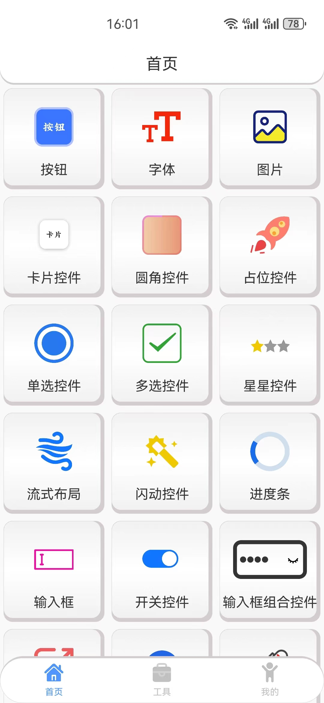
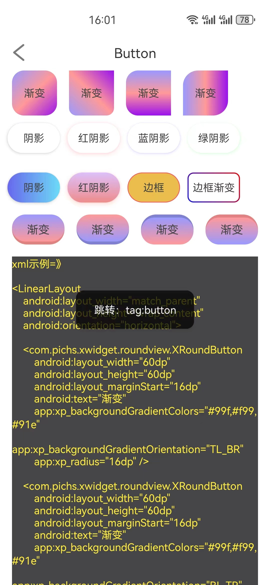
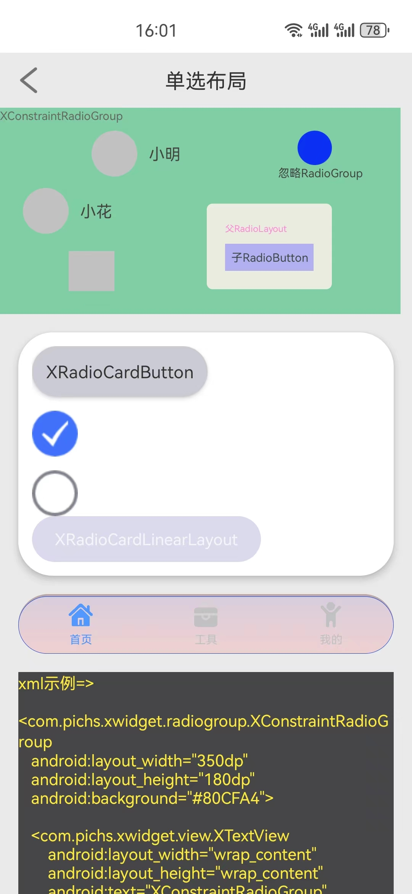
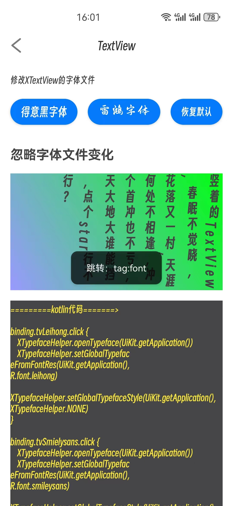
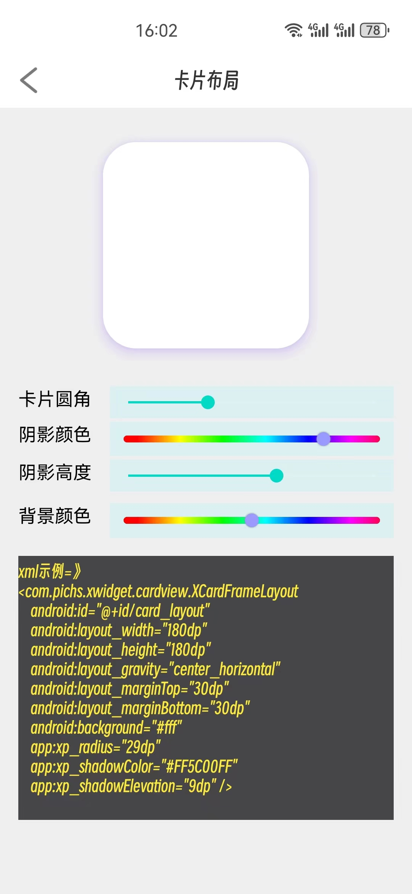
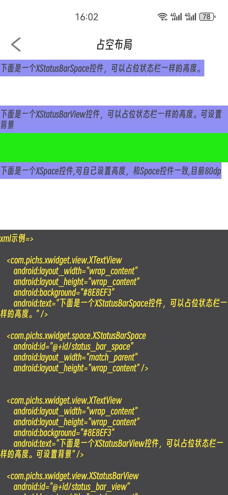
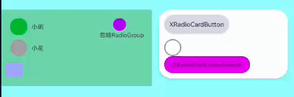

# 碉堡了的基础组件库

用心创造快乐！

### 好用的很，直接上车！

- 还在为写布局太慢而困扰？还在为写的圆角而心烦？还在为各种渐变头疼？
- 当你用了这个库，**你可以直接起飞**
- 圆角，阴影，按压效果，渐变色，属性一键实现。
- 致力于快速开发基础控件，省去大量写xml文件的时间。效果实时可预览。

### 引入控件

### 最新版本:[](https://img.shields.io/maven-central/v/com.gitee.pichs/xwidget)

      implementation 'com.gitee.pichs:xwidget:5.0.0'


### 先看效果
- 首页底部导航时XLinearRadioGroup+XRadioCardLinearLayout+XRadioImageView+XRadioCardButton实现。
- 

<br/>

- 按钮，渐变，方向，边框，圆角，阴影，按压效果，checked效果，activated效果。
- 

<br/>

- 单选组，XCardLinearRadioGroup+XRadioCardLinearLayout+XRadioCardButton实现。
- 

<br/>

- 文字，字体自定义-热切换
- 

<br/>

- 卡片，阴影，圆角。
- 

<br/>

- 占位控件 XSpace, XStatusBarSpace, XStatusBarView
- 

<br/>

## 非常好用基础组件库，超简单，快速。

- 特色杜绝属性冲突，系统属性尽量复用，属性前缀 ‘xp_’ ,简短快速。

- 圆角，外阴影，圆头跟随高度宽度，渐变色背景->双色渐变：top->bottom，left->right,TL->BR, BL->TR

- 按压效果，仍然支持渐变，圆角等。 支持按压透明变化，disabled透明变化。

- checked效果，activated效果，支持属性状态预览。

- 致力于快速开发基础控件，省去大量写xml文件的时间。效果实时可预览。

- 更多功能可查看demo，或者体验Apk

## 下载体验

[下载体验](https://github.com/pichsy/xwidget/tree/github-xwidget/app/release/app-release.apk)

### 持续维护，已更新四年了。持续增强更有用的功能，简单而强大。

- 如果用起来不爽，大胆进言，我会尽力满足你的需求。

#### 使用示例去 demo中的xml中探索吧。

- 注意：凡是继承自xwidget的基础类的textview都可以实现字体变更

1. 在Application中初始化

   ```
     // 初始化，自动缓存。
     public class App extends Application {
         @Override
         public void onCreate() {
             super.onCreate();
             XTypefaceHelper.init(this, true);
         }
     }
   
     XCardButton btn = findViewById(R.id.btn1);
     btn.setOnClickListener(v -> {
         XTypefaceHelper.setGlobalTypefaceFromAssets(getApplicationContext(), "leihong.ttf");
         XTypefaceHelper.setGlobalTypefaceStyle(getApplicationContext(), XTypefaceHelper.NONE);
     });
     XButton normalBtn = findViewById(R.id.normalBtn);
     normalBtn.setOnClickListener(v -> XTypefaceHelper.resetTypeface(MainActivity.this));
     XButton closeFont = findViewById(R.id.closeFont);
     XButton openFont = findViewById(R.id.openFont);
   
     closeFont.setOnClickListener(v -> XTypefaceHelper.closeTypeface(this));
     openFont.setOnClickListener(v -> XTypefaceHelper.openTypeface(this));
   
   ```

## 代码混淆

    版本混淆规则
    -keep class com.pichs.xwidget.**{ *; }

  

## 升级日志

### 5.0.0

- XView系列全系增加android:checked属性，和 xp_activated属性
- 属性新增 xp_activated, 可属性设置activatedXXX系列属性 默认状态。xml中可实时预览。
- 新增字体 可设置font目录中的全局字体，并保存，下次可生效。
- shine系列控件新增属性：xp_shine_flashing_colors 可自定义闪动的颜色数组，颜色值逗号分割。
- 修改XImageView系列继承自ImageView，而不是AppCompatImageView，修复XImageView的动态创建属性失效的问题。
- 优化XRadioGroup系列，更多实用方式。
- 新增XPressScaleFrameLayout,且新增XPressScaleLinearLayout,XPressScaleConstraintLayout
- 完善demo，体验更好，更好的借鉴api，demo中直接展示代码。
- XView系列，全系实现Checkable接口，xp_checke...系列属性全部生效
- 增加 X...RadioGroup系列,可作为单选组容器
- 增加 XRadio....系列，可作为单选组子控件
- 修改 XCheckBox的监听回调中的参数，第一个参数改为顶层View。
- 增加XRadio...子控件系列 属性 xp_ignore_radio_group ,添加此属性可以忽略父控件的单选组效果，即不参与单选组的单选效果。

- 使用手册：
1. X...RadioGroup系列 都是继承自'父View'控件属性方式完全一致，只是增加了单选组效果，其他属性完全一致。
2. XRadio...系列 都是继承自原'子View'控件属性方式完全一致，只是增加了单选组效果，其他属性完全一致。
3. XRadio...系列 可以单独使用，效果和继承的控件一致且效果一样
4. X...RadioGroup系列 可以单独使用，效果和继承的控件一致且效果一样
5. 只有X...RadioGroup系列 和 XRadio...系列 配合使用才能实现单选效果。
    - 使用示例：

    ```xml
              <com.pichs.xwidget.radiogroup.XCardLinearRadioGroup
                  android:layout_width="300dp"
                  android:layout_height="wrap_content"
                  android:background="#fff"
                  android:orientation="vertical"
                  android:padding="12dp"
                  app:xp_radius="30dp"
                  app:xp_shadowAlpha="1"
                  app:xp_shadowColor="#000"
                  app:xp_shadowElevation="5dp">
   
   
                  <com.pichs.xwidget.radiobutton.XRadioCardButton
                      android:layout_width="wrap_content"
                      android:layout_height="wrap_content"
                      android:background="#CBCBD3"
                      android:padding="12dp"
                      android:shadowColor="#3838EF"
                      android:text="XRadioCardButton"
                      android:textColor="#333"
                      android:textSize="15sp"
                      app:xp_checkedBackground="#563CF3"
                      app:xp_checkedTextColor="#fff"
                      app:xp_isRadiusAdjustBounds="true"
                      app:xp_shadowElevation="3dp" />
   
                  <com.pichs.xwidget.radiobutton.XRadioImageView
                      android:layout_width="40dp"
                      android:layout_height="40dp"
                      android:layout_marginTop="12dp"
                      android:src="@drawable/ic_agree_unckecked"
                      app:xp_checked_src="@drawable/ic_agree_checked" />
   
                  <com.pichs.xwidget.radiobutton.XRadioCardLinearLayout
                      android:layout_width="200dp"
                      android:layout_height="40dp"
                      android:background="#DADAEC"
                      android:gravity="center"
                      app:xp_checkedBackground="#BE0FD1"
                      app:xp_radius="20dp">
   
                      <androidx.appcompat.widget.AppCompatTextView
                          android:layout_width="wrap_content"
                          android:layout_height="wrap_content"
                          android:layout_gravity="center"
                          android:text="XRadioCardLinearLayout" />
   
                  </com.pichs.xwidget.radiobutton.XRadioCardLinearLayout>
              </com.pichs.xwidget.radiogroup.XCardLinearRadioGroup>
   
      ```

- 示例效果
- 


### 属性说明
- 大部分属性都会复用系统原有属性，并且作为控件的默认属性。


## 更新计划

- 已全部完成
1. ~~优化 cube属性，使其更加全能，增加更多立体按钮效果，包括凹陷按钮效果~~ 💯✔️
2. ~~增加 X...RadioGroup, 直属子类可用XRadio...子控件，并且其他布局随意添加不参加单选，只做辅助显示。~~  💯✔️