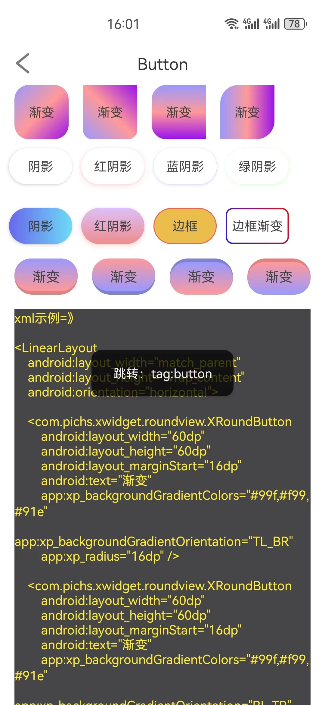
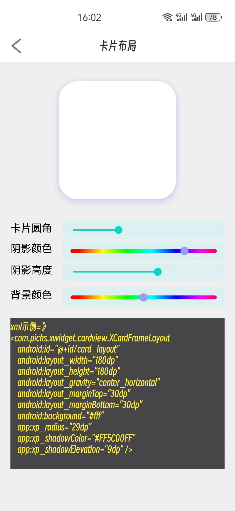
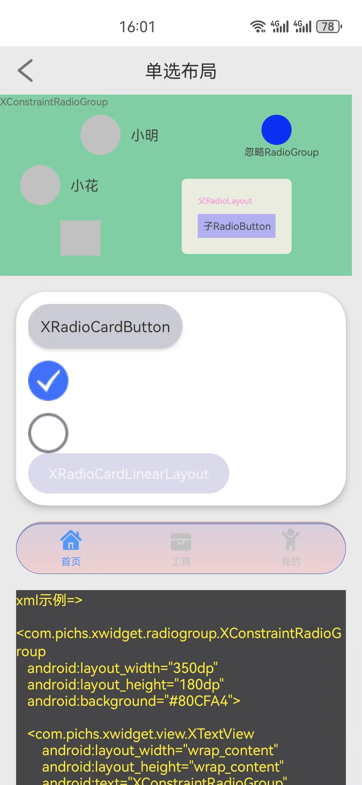
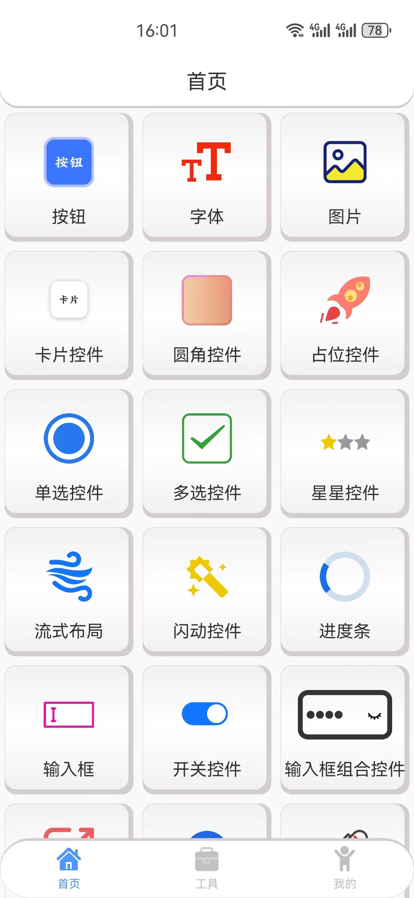
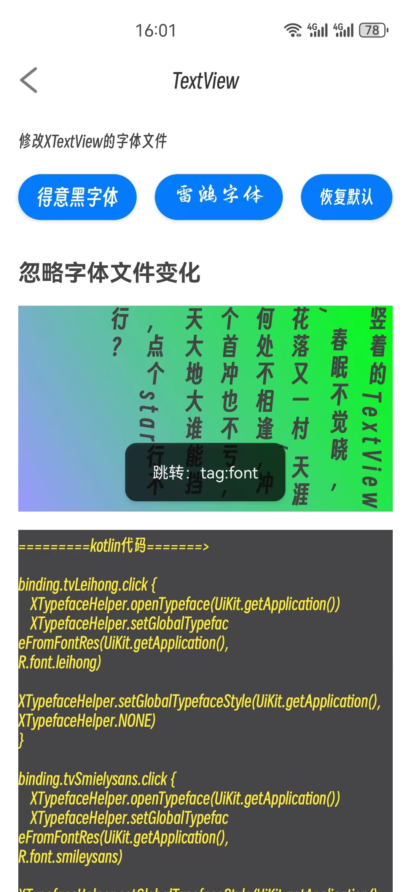
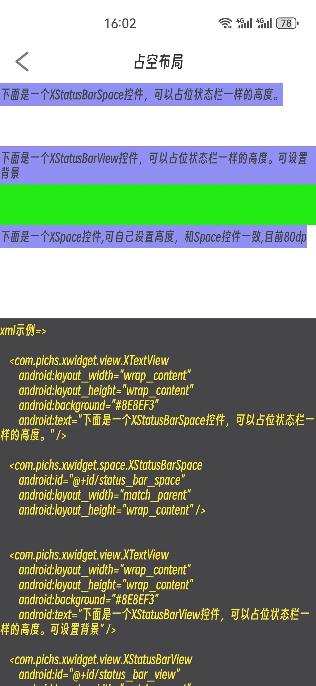

# XWidget - Android 基础组件库

[](https://img.shields.io/maven-central/v/com.gitee.pichs/xwidget)
[](https://opensource.org/licenses/Apache-2.0)

> **用心创造快乐！** - 一个功能强大、简单易用的 Android UI 组件库

XWidget 是一个专业的 Android 基础组件库，致力于快速开发基础控件，省去大量编写 XML 文件的时间。支持圆角、渐变、阴影、按压效果、状态切换等丰富特性，效果可实时预览。

---

## ✨ 核心特性

- 🎨 **多状态支持** - 支持 normal、pressed、checked、activated、disabled 五种状态
- 🌈 **渐变背景** - 支持线性渐变、多色渐变，支持四种渐变方向
- 🔘 **圆角边框** - 支持统一圆角和四角独立圆角设置
- 🌟 **阴影效果** - 支持自定义阴影颜色、高度、透明度
- 📦 **立体效果** - 支持 3D 立体按钮效果，可自定义各面高度
- ⚡ **动画效果** - 支持按压缩放、透明度变化等动画
- 🎡 **滚轮选择器** - 支持 3D 旋转效果的滚轮选择器
- 📝 **丰富表单控件** - 复选框、单选按钮、评分条、开关、输入框等
- 🔧 **实用工具类** - 状态栏、颜色、显示、设备等工具类

---

## 📦 引入依赖

在项目的 `build.gradle` 中添加：

```gradle
implementation 'com.gitee.pichs:xwidget:5.8.1'
```

---

## ⚠️ 重要提示 - XRound & XCard 系列使用必读

> **🔴 关键规则：XRound 和 XCard 系列控件使用渐变/边框前必须设置背景！**

在使用 **XRound 系列**（XRoundButton、XRoundConstraintLayout 等）和 **XCard 系列**（XCardConstraintLayout、XCardLinearLayout 等）时，如果要设置渐变背景或边框效果，**必须先设置 `android:background` 属性**（即使是透明色也要设置）！,因为背景是基于GradientDrawable实现的，如果背景没有设置，那么渐变和边框效果将无法显示。 不设置背景时不生成GradientDrawable对象，以便于降低内存消耗。

```xml
<!-- ❌ 错误示例 - 渐变和边框不会显示 -->
<com.pichs.xwidget.roundview.XRoundButton
    android:text="按钮"
    app:xp_radius="8dp"
    app:xp_borderColor="#E0E0E0"
    app:xp_borderWidth="1dp" />

<!-- ✅ 正确示例 - 先设置 background -->
<com.pichs.xwidget.roundview.XRoundButton
    android:text="按钮"
    android:background="@android:color/transparent"
    app:xp_radius="8dp"
    app:xp_borderColor="#E0E0E0"
    app:xp_borderWidth="1dp" />
```

**📋 适用场景：**
- ✅ 设置渐变背景时 → 必须先设置 `android:background`
- ✅ 设置边框时 → 必须先设置 `android:background`
- ✅ 设置渐变边框时 → 必须先设置 `android:background` + `xp_borderWidth`
- ✅ 设置立体效果时（XRound 专有）→ 必须先设置 `android:background`

**💡 说明**：XView 系列（XButton、XTextView、XImageView 等）不受此限制，可以直接使用渐变和边框属性。

---

## 🌟 核心亮点 - 这就是我们的特色

### 1️⃣ XRound 系列 - 圆角从未如此简单

> **⚠️ 重要提示**：使用渐变、边框或立体效果前，必须先设置 `android:background`（可以是透明色）！

**痛点**：实现圆角按钮需要创建 drawable 文件，麻烦且不够灵活。

**解决方案**：一个属性搞定！

```xml
<!-- 传统方式：需要创建 drawable 文件 -->
<Button 
    android:background="@drawable/bg_round_button" />

<!-- XRound 方式：一行搞定（注意先设置 background！） -->
<com.pichs.xwidget.roundview.XRoundButton
    android:text="圆角按钮"
    android:background="@android:color/transparent"
    app:xp_radius="24dp"
    app:xp_backgroundGradientColors="#667eea,#764ba2" />
```

**特色功能**：
- ✅ 四个角独立设置圆角：`xp_radiusTopLeft`、`xp_radiusTopRight`、`xp_radiusBottomLeft`、`xp_radiusBottomRight`
- ✅ 支持渐变背景、边框、阴影
- ✅ 支持按压、选中、禁用等多种状态
- ✅ 支持 3D 立体效果（Cube 效果）
- ✅ XML 中实时预览效果

**⚠️ 使用渐变/边框/立体效果时，请务必先设置 `android:background`！详见[重要提示](#️-重要提示---xround--xcard-系列使用必读)**

---

### 2️⃣ XCard 系列 - 卡片式布局之王

> **⚠️ 重要提示**：使用渐变或边框效果前，必须先设置 `android:background`（可以是透明色）！

**痛点**：Material 的 CardView 功能单一，自定义阴影麻烦，列表场景无法隐藏特定边的圆角。

**解决方案**：更强大的卡片布局，阴影、圆角、渐变一应俱全！

```xml
<!-- 传统 CardView：功能有限 -->
<androidx.cardview.widget.CardView
    app:cardCornerRadius="12dp"
    app:cardElevation="4dp">
    <!-- 内容 -->
</androidx.cardview.widget.CardView>

<!-- XCard：功能强大（注意先设置 background！） -->
<com.pichs.xwidget.cardview.XCardConstraintLayout
    android:background="@android:color/transparent"
    app:xp_radius="12dp"
    app:xp_shadowElevation="4dp"
    app:xp_shadowColor="#40000000"
    app:xp_backgroundGradientColors="#FFFFFF,#F5F5F5"
    app:xp_backgroundGradientOrientation="vertical">
    <!-- 内容 -->
</com.pichs.xwidget.cardview.XCardConstraintLayout>

<!-- 列表场景：隐藏底部圆角（适合列表中间项） -->
<com.pichs.xwidget.cardview.XCardLinearLayout
    android:background="@android:color/transparent"
    app:xp_radius="12dp"
    app:xp_hideRadiusSide="bottom"
    app:xp_shadowElevation="2dp">
    <!-- 列表项内容 -->
</com.pichs.xwidget.cardview.XCardLinearLayout>
```

**特色功能**：
- ✅ 自定义阴影颜色和透明度
- ✅ 支持渐变背景
- ✅ 支持按压、选中状态
- ✅ 支持边框渐变
- ✅ **隐藏特定边圆角** - `xp_hideRadiusSide` 可设置 `none`/`top`/`right`/`bottom`/`left`，完美适配列表场景
- ✅ 继承自原生布局，所有原生属性都可用

**⚠️ 使用渐变/边框效果时，请务必先设置 `android:background`！详见[重要提示](#️-重要提示---xround--xcard-系列使用必读)**

---

### 3️⃣ XImageView 系列 - 图片控件的终极解决方案

**痛点**：实现圆形头像、圆角图片需要自定义或第三方库。

**解决方案**：一个控件，所有图片效果！

```xml
<!-- 传统方式：需要使用第三方库 -->
<de.hdodenhof.circleimageview.CircleImageView
    android:src="@drawable/avatar" />

<!-- XImageView 方式：原生控件即可实现 -->
<com.pichs.xwidget.roundview.XRoundImageView
    android:src="@drawable/avatar"
    app:xp_isRadiusAdjustBounds="true" />

<!-- 圆角图片 -->
<com.pichs.xwidget.roundview.XRoundImageView
    android:src="@drawable/image"
    app:xp_radius="12dp" />

<!-- 带边框的圆形头像 -->
<com.pichs.xwidget.roundview.XRoundImageView
    android:src="@drawable/avatar"
    app:xp_isRadiusAdjustBounds="true"
    app:xp_borderWidth="2dp"
    app:xp_borderColor="#FFFFFF" />
```

**特色功能**：
- ✅ `xp_isRadiusAdjustBounds="true"` 自动适配为圆形
- ✅ 支持四角独立圆角
- ✅ 支持边框和边框渐变
- ✅ 支持选中/未选中切换图片（`xp_checked_src`）
- ✅ 完全兼容 ImageView 所有功能

---

### 4️⃣ XWheelView - 3D 滚轮选择器

**痛点**：实现 iOS 风格的滚轮选择器非常困难，第三方库不够灵活。

**解决方案**：真正的 3D 滚轮选择器，支持自定义绘制！

```xml
<!-- 3D 滚轮选择器 -->
<com.pichs.xwidget.wheel.XWheelView
    android:layout_width="match_parent"
    android:layout_height="200dp"
    app:xp_wheelOrientation="vertical"
    app:xp_wheelItemCount="5"
    app:xp_wheelItemSize="50dp"
    app:xp_wheelTextSize="20sp"
    app:xp_wheelTextColor="#999999"
    app:xp_wheelTextCenterColor="#333333"
    app:xp_wheelDividerColor="#E0E0E0"
    app:xp_wheelGradient="true"
    app:xp_wheelTextSelectedBold="true" />
```

```kotlin
// 代码设置数据
wheelView.setAdapter(object : XWheelView.Adapter() {
    override fun getItemCount() = 10
    override fun getItem(position: Int) = "选项 ${position + 1}"
})

// 监听选中
wheelView.addOnItemSelectedListener { _, index ->
    Log.d("WheelView", "Selected: $index")
}
```

**特色功能**：
- ✅ 真正的 3D 旋转效果（基于 Camera 实现）
- ✅ 支持线性滚动效果（无旋转）
- ✅ 支持垂直和水平两种方向
- ✅ 支持渐变透明度
- ✅ 支持自定义绘制器（ItemPainter）
- ✅ 基于 RecyclerView，性能卓越
- ✅ 完美适配日期选择器、城市选择器等场景

---

### 5️⃣ 一键多状态 - 省去 99% 的 selector 文件

**痛点**：实现按压效果需要创建 selector 文件，修改麻烦。

**解决方案**：所有状态，属性直接设置！

```xml
<!-- 传统方式：需要创建多个 drawable + selector -->
<Button android:background="@drawable/selector_button" />

<!-- XWidget 方式：属性直接设置 -->
<com.pichs.xwidget.view.XButton
    android:text="多状态按钮"
    app:xp_radius="8dp"
    app:xp_backgroundGradientColors="#3498DB,#2980B9"
    app:xp_pressedBackgroundGradientColors="#E74C3C,#C0392B"
    app:xp_checkedBackgroundGradientColors="#27AE60,#229954"
    app:xp_disabledBackgroundGradientColors="#95A5A6,#7F8C8D"
    app:xp_pressedScale="0.95"
    app:xp_pressedAlpha="0.8" />
```

**支持的状态**：
- ✅ **normal** - 正常状态
- ✅ **pressed** - 按压状态（`xp_pressed...`）
- ✅ **checked** - 选中状态（`xp_checked...`）
- ✅ **activated** - 激活状态（`xp_activated...`）
- ✅ **disabled** - 禁用状态（`xp_disabled...`）

---

### 6️⃣ 渐变 + 圆角 + 阴影 = 一行代码

**痛点**：实现渐变背景 + 圆角 + 阴影需要多个 layer-list 嵌套。

**解决方案**：所有效果都是属性！

```xml
<!-- 传统方式：需要复杂的 layer-list -->
<View android:background="@drawable/complex_background" />

<!-- XWidget 方式：一个控件搞定（XCard 系列记得先设置 background！） -->
<com.pichs.xwidget.cardview.XCardButton
    android:text="立即购买"
    android:background="@android:color/transparent"
    app:xp_radius="24dp"
    app:xp_backgroundGradientColors="#FF6B6B,#4ECDC4,#45B7D1"
    app:xp_backgroundGradientOrientation="TL_BR"
    app:xp_shadowElevation="8dp"
    app:xp_shadowColor="#40FF6B6B"
    app:xp_borderWidth="1dp"
    app:xp_borderGradientColors="#FFFFFF,#F0F0F0"
    app:xp_pressedScale="0.95" />
```

**四种渐变方向**：
- `horizontal` - 水平渐变（左→右）
- `vertical` - 垂直渐变（上→下）
- `TL_BR` - 左上→右下
- `BL_TR` - 左下→右上

---

## 📚 文档

- [📖 详细文档](详细文档.md) - 完整的组件使用指南和示例
- [📝 更新日志](CHANGELOG.md) - 版本更新记录
- [🔄 升级指南](老版本升级指南.md) - 老版本升级说明

---

## 🎯 核心组件

### XView 系列 - 基础增强控件
- `XButton` - 增强按钮
- `XTextView` - 增强文本视图
- `XImageView` - 增强图片视图
- `XConstraintLayout` - 增强约束布局
- `XLinearLayout` - 增强线性布局
- `XFrameLayout` - 增强帧布局

### XCard 系列 - 卡片式布局
- `XCardButton` - 卡片按钮
- `XCardConstraintLayout` - 卡片约束布局
- `XCardLinearLayout` - 卡片线性布局
- `XCardFrameLayout` - 卡片帧布局

### XRound 系列 - 圆角布局
- `XRoundButton` - 圆角按钮
- `XRoundConstraintLayout` - 圆角约束布局
- `XRoundLinearLayout` - 圆角线性布局
- `XRoundImageView` - 圆角图片视图

### 表单控件系列
- `XCheckBox` / `XSmoothCheckBox` - 复选框
- `XRadioButton` / `XRadioGroup` - 单选按钮/组
- `XRatingBar` - 评分条
- `XSwitchButton` - 开关按钮
- `XProgressBar` - 进度条
- `XInputLayout` - 输入布局
- `XVerificationCodeEditText` - 验证码输入框

### 滚轮选择器系列
- `XWheelView` - 3D 滚轮选择器
- `XWheelParams` - 滚轮参数配置
- `XWheelDrawManager` - 3D 旋转绘制管理器
- `XWheelLinearDrawManager` - 线性绘制管理器

### 特殊效果系列
- `ShineButton` - 闪光按钮
- `XPressScaleLayout` - 按压缩放布局
- `XFlowLayout` - 流式布局
- `XNestedScrollLayout` - 嵌套滚动布局

### 工具类
- `XStatusBarHelper` - 状态栏管理
- `XColorHelper` - 颜色处理
- `XDisplayHelper` - 屏幕显示管理
- `XDeviceHelper` - 设备信息管理
- `XGradientHelper` - 渐变背景管理

---

## 🖼️ 效果预览

<table>
  <tr>
    <td><br/><center>渐变按钮</center></td>
    <td><br/><center>卡片布局</center></td>
    <td><br/><center>单选组</center></td>
  </tr>
  <tr>
    <td><br/><center>底部导航</center></td>
    <td><br/><center>字体切换</center></td>
    <td><br/><center>占位控件</center></td>
  </tr>
</table>

---

## 💡 使用技巧

### 属性命名规范

- **系统属性优先** - 框架尽量复用系统原有属性
- **xp_ 前缀** - 自定义属性统一使用 `xp_` 前缀，简短快速
- **智能提示** - 使用时通过 `xp_` 代码提示快速查找

### 全局字体切换

```kotlin
// 在 Application 中初始化
class App : Application() {
    override fun onCreate() {
        super.onCreate()
        XTypefaceHelper.init(this, true)
    }
}

// 切换字体
XTypefaceHelper.setGlobalTypefaceFromAssets(context, "custom_font.ttf")

// 重置字体
XTypefaceHelper.resetTypeface(context)

// 开启/关闭字体
XTypefaceHelper.openTypeface(context)
XTypefaceHelper.closeTypeface(context)
```

### 混淆规则

在 `proguard-rules.pro` 中添加：

```proguard
-keep class com.pichs.xwidget.**{ *; }
```

---

## 📱 下载体验

[点击下载 Demo APK](https://github.com/pichsy/xwidget/tree/github-xwidget/app/release/app-release.apk)

---

## 🔄 版本历史

### v5.8.0 - 当前版本
- 新增 XWheelView 滚轮选择器组件
- 支持 3D 旋转效果和线性效果
- 优化性能和稳定性

[查看完整更新日志](CHANGELOG.md)

---

## 🤝 贡献

欢迎提交 Issue 和 Pull Request！

如果这个项目对你有帮助，请给个 ⭐️ Star 支持一下吧！

---

## 📄 许可证

```
Copyright 2022 pichs

Licensed under the Apache License, Version 2.0 (the "License");
you may not use this file except in compliance with the License.
You may obtain a copy of the License at

    http://www.apache.org/licenses/LICENSE-2.0

Unless required by applicable law or agreed to in writing, software
distributed under the License is distributed on an "AS IS" BASIS,
WITHOUT WARRANTIES OR CONDITIONS OF ANY KIND, either express or implied.
See the License for the specific language governing permissions and
limitations under the License.
```

---

## 📮 联系方式

如有问题或建议，欢迎通过以下方式联系：

- 提交 [Issue](https://github.com/pichsy/xwidget/issues)
- 发送邮件到项目维护者

---

**持续维护，已持续更新四年。简单、稳定、强大。**

**用起来不爽？多提点 Bug，尽力满足你的需求！**