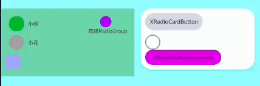

# 升级指南
### 5.x 最新版本:[](https://img.shields.io/maven-central/v/com.gitee.pichs/xwidget)

      implementation 'com.gitee.pichs:xwidget:5.0.0'
      
###### 4.x过度版本忽略      

### 3.x 最新版本: [](https://jitpack.io/#com.gitee.pichs/xwidget)

      implementation 'com.gitee.pichs:xwidget:3.2.5'


</br>
</br>

# ∆!∆ 升级指南到5.0.0 《重点》
**改好前两条 就可以了升级了。非常的简单，全局替换**
 </br>
 
1. (**替换∆**)  全局搜索包名并替换 "com.pichs.common.widget." ->  "com.pichs.xwidget." 即可完成替换，非常的简单！
1. (**替换∆**)  属性删除，采用系统属性`app:xp_checked` -> `android:checked` ，需要搜索全局替换
2. (**修改∆**)  颜色默认值不再判断为0，改为0x0000000f(15)-该值比较罕见，不会影响到正常的颜色值，布局里可以用`#00000000 ，即透明色`来直接设置背景了。 
2. (**替换∆**)  类删除，XCheckedTextView删除，使用任一XTextView可替换。***《此控件应该没人用,忽略》***
1. (**替换∆**)  删除PressedScaleLayout，新增XPressScaleFrameLayout,且新增XPressScaleLinearLayout,XPressScaleConstraintLayoutXCardTextView,XRoundTextView可替换。***《此控件应该没人用,忽略》***。
1.  (新增)  属性新增 xp_activated, 可属性设置activatedXXX系列属性 默认状态。xml中可实时预览。
1.  (新增)  新增字体 可设置font目录中的全局字体，并保存，下次可生效。
1.  (新增)  shine系列控件新增属性：`xp_shine_flashing_colors ` 可自定义闪动的颜色数组，颜色值逗号分割。
1. (新增)  XView系列全系增加`android:checked`属性，和 `xp_activated ` 属性 
1. (**BUG修复**)  修复XImageView的动态创建属性失效的问题。
1.  (新增)  优化XRadioGroup系列，更多实用方式。
1. (修改--无感)  修改XImageView系列继承自ImageView，而不是AppCompatImageView


</br>
</br>

## 操作示例

- 全局搜索包名并替换 "com.pichs.common.widget." ->  "com.pichs.xwidget." 即可完成替换，非常的简单！
- 示例：
- 


## 升级日志

### 5.0.0升级指南

- 属性删除，采用系统属性`app:xp_checked` -> `android:checked`
- 类删除，XCheckedTextView删除，使用任一XTextView，XCardTextView,XRoundTextView可替换。
- 属性新增 xp_activated, 可属性设置activatedXXX系列属性 默认状态。xml中可实时预览。
- 新增字体 可设置font目录中的全局字体，并保存，下次可生效。
- shine系列控件新增属性：xp_shine_flashing_colors 可自定义闪动的颜色数组，颜色值逗号分割。
- 修改XImageView系列继承自ImageView，而不是AppCompatImageView
- XView系列全系增加android:checked属性，和 xp_activated属性
- 修复XImageView的动态创建属性失效的问题。
- 优化XRadioGroup系列，更多实用方式。
- 删除PressedScaleLayout，新增XPressScaleFrameLayout,且新增XPressScaleLinearLayout,XPressScaleConstraintLayout
- 完善demo，体验更好，更好的借鉴api，demo中直接展示代码。

### 4.1.0版本

- XView系列，全系实现Checkable接口，xp_checke...系列属性全部生效
- 增加 X...RadioGroup系列,可作为单选组容器
- 增加 XRadio....系列，可作为单选组子控件
- 修改 XCheckBox的监听回调中的参数，第一个参数改为顶层View。
- 增加XRadio...子控件系列 属性 xp_ignore_radio_group ,添加此属性可以忽略父控件的单选组效果，即不参与单选组的单选效果。
- 使用手册：

1. X...RadioGroup系列 都是继承自'父View'控件属性方式完全一致，只是增加了单选组效果，其他属性完全一致。
2. XRadio...系列 都是继承自原'子View'控件属性方式完全一致，只是增加了单选组效果，其他属性完全一致。
3. XRadio...系列 可以单独使用，效果和继承的控件一致且效果一样
4. X...RadioGroup系列 可以单独使用，效果和继承的控件一致且效果一样
5. 只有X...RadioGroup系列 和 XRadio...系列 配合使用才能实现单选效果。
    - 使用示例：

      ```xml
              <com.pichs.xwidget.radiogroup.XCardLinearRadioGroup
                  android:layout_width="300dp"
                  android:layout_height="wrap_content"
                  android:background="#fff"
                  android:orientation="vertical"
                  android:padding="12dp"
                  app:xp_radius="30dp"
                  app:xp_shadowAlpha="1"
                  app:xp_shadowColor="#000"
                  app:xp_shadowElevation="5dp">
   
   
                  <com.pichs.xwidget.radiobutton.XRadioCardButton
                      android:layout_width="wrap_content"
                      android:layout_height="wrap_content"
                      android:background="#CBCBD3"
                      android:padding="12dp"
                      android:shadowColor="#3838EF"
                      android:text="XRadioCardButton"
                      android:textColor="#333"
                      android:textSize="15sp"
                      app:xp_checkedBackground="#563CF3"
                      app:xp_checkedTextColor="#fff"
                      app:xp_isRadiusAdjustBounds="true"
                      app:xp_shadowElevation="3dp" />
   
                  <com.pichs.xwidget.radiobutton.XRadioImageView
                      android:layout_width="40dp"
                      android:layout_height="40dp"
                      android:layout_marginTop="12dp"
                      android:src="@drawable/ic_agree_unckecked"
                      app:xp_checked_src="@drawable/ic_agree_checked" />
   
                  <com.pichs.xwidget.radiobutton.XRadioCardLinearLayout
                      android:layout_width="200dp"
                      android:layout_height="40dp"
                      android:background="#DADAEC"
                      android:gravity="center"
                      app:xp_checkedBackground="#BE0FD1"
                      app:xp_radius="20dp">
   
                      <androidx.appcompat.widget.AppCompatTextView
                          android:layout_width="wrap_content"
                          android:layout_height="wrap_content"
                          android:layout_gravity="center"
                          android:text="XRadioCardLinearLayout" />
   
                  </com.pichs.xwidget.radiobutton.XRadioCardLinearLayout>
              </com.pichs.xwidget.radiogroup.XCardLinearRadioGroup>
   
   
      ```

- 示例效果
- 

### 4.0.1版本

- 添加混淆规则，打入aar包，你不在需要自己手动添加混淆规则了。

### 4.0.0版本

- 破坏升级，控件包名由原来（com.pichs.common.widget.xxx）改为现在的（com.pichs.xwidget.xxxx），其他破坏暂无。
- 3.2.5版本的请移步 gitee 地址 [https://gitee.com/pichs/xwidget](https://gitee.com/pichs/xwidget/tree/3.2.5/)

- 3.2.5版本：仓库地址发布在jitpack上（仓库劣势，看aar源码费劲）
- 4.0.0及以上版本（新版） 仓库转移到mavenCenter上（仓库劣势，暂无）

### 3.2.5版本 推荐升级（兼容升级）

- 颜色默认值不再判断为0，改为0x0000000f(15)-该值比较罕见，不会影响到正常的颜色值。
- 增加新的控件 PressedScaleLayout，按压缩放子控件，可以设置缩放比例，缩放动画时间。

            <com.pichs.xwidget.layout.PressScaleLayout
                android:layout_width="300dp"
                android:layout_height="100dp"
                android:background="#A7A7CF"
                android:clickable="true"
                android:padding="16dp"
                app:xp_pressedScale="0.5"
                app:xp_pressedScaleAnimDuration="90">
          
                <com.pichs.xwidget.cardview.XCardTextView
                    android:layout_width="50dp"
                    android:layout_height="50dp"
                    android:gravity="center"
                    android:text="我是子控件"
                    android:textColor="#fff"
                    android:textSize="10dp"
                    app:xp_backgroundGradientColors="#9f1,#42f"
                    app:xp_radius="8dp" />
          
            </com.pichs.xwidget.layout.PressScaleLayout>


- 修复InputLayout close图标显示不正常的问题
- 基础控件都增加了按压事件回调 (XView...等).setOnPressedStateListener(isPressed ->{})

### 3.2.4版

- 修复InputLayout控件 close图标显示不正常的bug。

### 3.2.3版本

- 增加XRatingBar控件，支持自定义星星数量，星星大小，星星间距，星星背景，星星前景，星星数量，星星是否可以点击，星星是否可以半颗星

### 3.2.2版本

- 修复statusbarheight方法，在鸿蒙os3.0上获取数值不对的问题。

### 3.2.1版本

- 增强TimerManager的稳定性。

### 3.2.0 版本

- 兼容新增 xp_cubeSidesGradientColors 用来代替 xp_cubeFrontGradientColors属性（依然能用，建议用前者，名字更贴切）（兼容升级）
- 修改 cubeXXXedFrontGradientColors状态系列属性 用 cubeXXXSidesGradientColors代替 （破坏性，偏门属性，很少人用）
- 修改 cubeFrontBorderColor和cubeFrontBorderWidth用cubeSidesBorderColor和cubeSidesBorderWidth代替 （破坏性，偏门属性，很少人用）
- 新增 cubeBackHeight，cubeLeftHeight,cubeRightHeight和原有属性cubeFrontHeight形成完整一套Api可以实现更多效果，如按下凹陷，松开弹起等，
- 新增 xp_pressedScale属性，按压缩放，可以放大放小，xp_disabledScale:不可用时放大缩小（带动画）
- 对应的set方法也会同样删减和增加。

### 3.1.2版本

- 优化属性的使用

- xp_pressedCubeFrontHeight="2dp" 现在按压及其他状态效果只需要设置对应的height也可以了，背景色默认会使用xp_backgroundGradientColors/(
  xp_backgroundGradientStartColor...)对应的背景色。

- 总之用起来更舒服了，代码也可以减少了。

### 3.1.1版本

- 不常用方法setBorderGradientStartColor和setBorderGradientEndColor删除
- 新增setBorderGradientColors()一次性设置两个，防止重复刷新绘制

### 3.1.0版本

- 兼容升级

- XSpace替代Space （新版AS：Space在xml中用，没有属性提示）

- XWebView替代WebView （新版AS：WebView在xml中用，没有属性提示）

- XView系列，XRoundView系列 新增 xp_backgroundGradientColors属性 支持多色渐变，颜色值随意+

  ```
      颜色值支持超全写法，和xml中写法一致随意写，支持以下四种写法
      例：xxxGradientColors="#rbg,#argb,#rrggbb,#aarrggbb"
      真实案例：
      app:xp_backgroundGradientColors="#00f,#ffff00,#999,#87ff,#98ff,#f0f"
      app:xp_pressedBackgroundGradientColors="#00f,#ff0"
  
  ```

- XRoundxxx系列-->新增xp_cubeFront_xxx...属性，立体按钮效果 即动态LayerDrawable

- LayerDrawable结合StateListDrawable->实现立体按钮按压效果

- 温馨提示：cube属性必须结合 + background属性才可以生效，因为两者是一体的，都属于背景drawable生成时必要的参数。

- 看例子：xp_backgroundGradientColors + xp_cubeFrontGradientColors

- ~~xp_pressedCubeFrontGradientColors + xp_pressedBackgroundGradientColors~~

- xp_pressedCubeFrontHeight="2dp" 现在按压及其他状态效果只需要设置对应的height也可以了，背景色默认会使用xp_backgroundGradientColors/(
  xp_backgroundGradientStartColor...)对应的背景色。

- 生僻单词：cube：立方体 + front: 前面 = cubeFront:立方体前面 (立方体正对着你的那个面)

  ```
       <com.pichs.common.widget.roundview.XRoundLinearLayout
             android:layout_width="120dp"
             android:layout_height="50dp"
             android:clickable="true"
             android:id="@+id/round_layout"
             app:xp_backgroundGradientOrientation="vertical"
             app:xp_backgroundGradientColors="#00f,#ff0"
             app:xp_cubeFrontGradientColors="#f00"
             app:xp_cubeFrontHeight="3dp"
             app:xp_pressedCubeFrontHeight="1.5dp"
             app:xp_radius="25dp" />
  
  ```
  
